# BÁO CÁO DỰ ÁN: WEBSITE THƯƠNG MẠI ĐIỆN TỬ ELECTRONICSHOP

Dự án này là một ứng dụng web thương mại điện tử được xây dựng bằng ASP.NET Core 8, mô phỏng một cửa hàng bán linh kiện điện tử trực tuyến.

## 1. Giới thiệu tổng quan

**ElectronicShopDotNETcore** là một ứng dụng web thương mại điện tử hiện đại, đầy đủ tính năng được xây dựng trên nền tảng ASP.NET Core 8. Dự án cung cấp một trải nghiệm mua sắm trực tuyến hoàn chỉnh, từ việc duyệt sản phẩm, quản lý giỏ hàng đến quy trình thanh toán an toàn. Dự án được thiết kế theo kiến trúc N-Tier (nhiều lớp) rõ ràng, giúp dễ dàng bảo trì, mở rộng và phát triển trong tương lai.

## 2. Các tính năng chính

Ứng dụng cung cấp đầy đủ các chức năng cần thiết cho một hệ thống E-commerce chuyên nghiệp:

*   **Phía khách hàng (Client):**
    *   **Trang chủ động:** Hiển thị sản phẩm nổi bật, sản phẩm mới và các danh mục.
    *   **Duyệt sản phẩm:** Người dùng có thể xem sản phẩm theo danh mục, tìm kiếm sản phẩm.
    *   **Chi tiết sản phẩm:** Xem thông tin chi tiết, hình ảnh, mô tả và giá của từng sản phẩm.
    *   **Giỏ hàng (Shopping Cart):** Thêm sản phẩm vào giỏ, cập nhật số lượng hoặc xóa sản phẩm khỏi giỏ hàng.
    *   **Thanh toán (Checkout):** Cung cấp quy trình thanh toán an toàn, cho phép người dùng nhập thông tin giao hàng.
    *   **Xác thực và phân quyền:** Người dùng có thể đăng ký, đăng nhập và quản lý tài khoản.
    *   **Lịch sử đơn hàng:** Người dùng đã đăng nhập có thể xem lại lịch sử các đơn hàng đã đặt.

*   **Phía quản trị (Admin):**
    *   **Quản lý sản phẩm:** Thêm, xóa, sửa thông tin sản phẩm.
    *   **Quản lý danh mục:** Thêm, xóa, sửa các danh mục sản phẩm.
    *   **Quản lý đơn hàng:** Xem và cập nhật trạng thái đơn hàng.

## 3. Phân tích và Thiết kế Chức năng

Phần này đi sâu vào việc phân tích các yêu cầu và thiết kế luồng hoạt động của các chức năng chính trong hệ thống.

### 3.1. Sơ đồ Usecase
Sơ đồ Usecase mô tả các tương tác giữa "tác nhân" (người dùng hoặc hệ thống khác) và hệ thống để đạt được một mục tiêu cụ thể. Nó cung cấp cái nhìn tổng quan về các chức năng mà hệ thống sẽ cung cấp.

Trong dự án này, sơ đồ Usecase chỉ rõ hai tác nhân chính: **Khách hàng (Customer)** và **Quản trị viên (Admin)**.
*   **Khách hàng** có thể thực hiện các chức năng như `Xem sản phẩm`, `Tìm kiếm`, `Thêm vào giỏ hàng`, và `Thanh toán`.
*   **Quản trị viên** có các quyền cao hơn như `Quản lý sản phẩm`, `Quản lý danh mục`, và `Quản lý đơn hàng`.

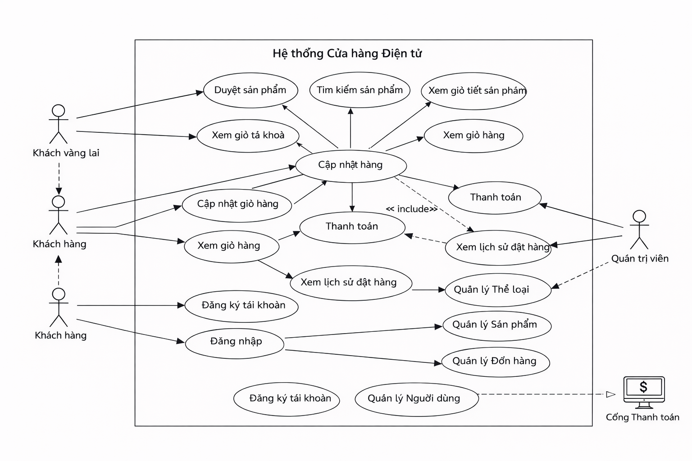

### 3.2. Luồng dữ liệu (DFD - Data Flow Diagram)
Sơ đồ luồng dữ liệu mô tả cách thông tin di chuyển qua một hệ thống. Nó cho thấy các tiến trình xử lý dữ liệu, các nơi lưu trữ dữ liệu (kho dữ liệu), và các dòng dữ liệu di chuyển giữa chúng.
*   **Sơ đồ mức 0 (Context Diagram):** Cho thấy toàn bộ hệ thống là một tiến trình duy nhất tương tác với các tác nhân bên ngoài.
*   **Sơ đồ mức 1, 2:** Phân rã hệ thống thành các tiến trình con chi tiết hơn, ví dụ như `Xử lý đơn hàng` hay `Quản lý kho`, và chỉ rõ luồng dữ liệu di chuyển giữa các tiến trình này và các kho dữ liệu (Data Store) như `Sản phẩm` hay `Đơn hàng`.

#### Mức 0
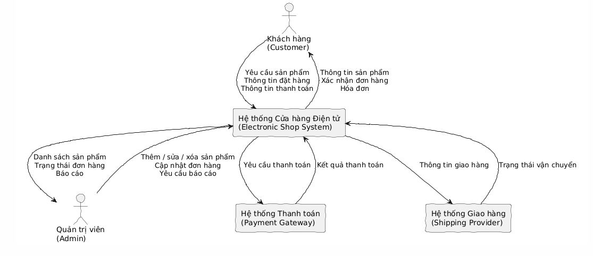
#### Mức 1
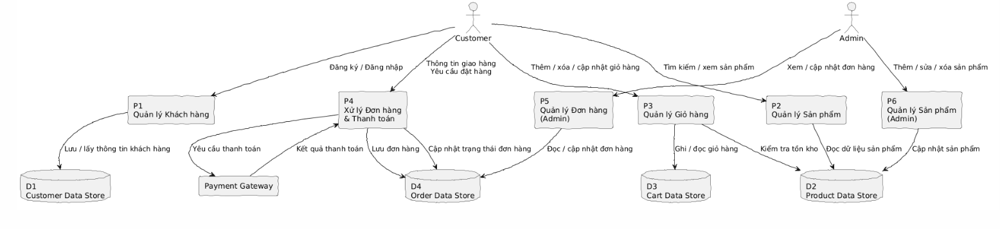
#### Mức 2
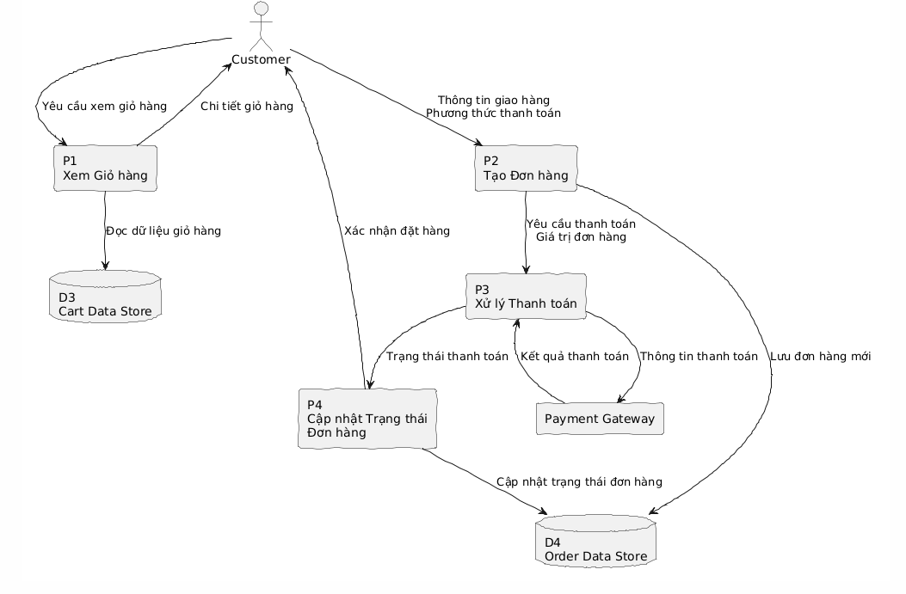

### 3.3. Sơ đồ Tuần tự (Sequence Diagram)
Sơ đồ tuần tự mô tả sự tương tác giữa các đối tượng theo một trật tự thời gian. Nó rất hữu ích để làm rõ kịch bản hoạt động của một chức năng cụ thể.

Ví dụ, sơ đồ tuần tự cho chức năng `Thêm vào giỏ hàng` sẽ minh họa các bước: người dùng nhấn nút 'Thêm', `ShoppingCartController` nhận yêu cầu, gọi đến `CartService` để xử lý logic, và cuối cùng `CartRepository` cập nhật thông tin vào cơ sở dữ liệu. Sơ đồ làm rõ thứ tự thời gian và sự tương tác giữa các lớp/đối tượng khác nhau.

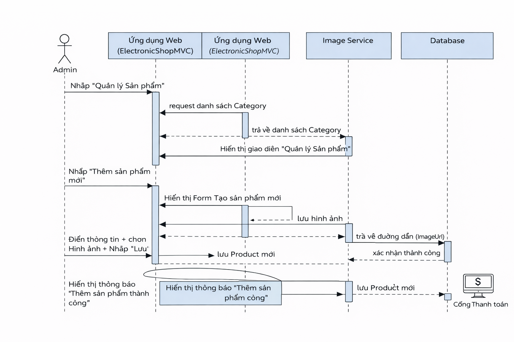

### 3.4. Sơ đồ Hoạt động (Activity Diagram)
Sơ đồ hoạt động mô tả luồng công việc (workflow) của một quy trình nghiệp vụ hoặc một ca sử dụng. Nó cho thấy các bước tuần tự và song song trong một quy trình.

Các sơ đồ này mô tả chi tiết các bước trong một quy trình, ví dụ như quy trình `Thanh toán`. Bắt đầu từ khi khách hàng xem giỏ hàng, đi qua các bước nhập thông tin giao hàng, chọn phương thức thanh toán, xác nhận, và cuối cùng là kết quả thành công hay thất bại. Sơ đồ này rất hữu ích để hiểu logic nghiệp vụ phức tạp.

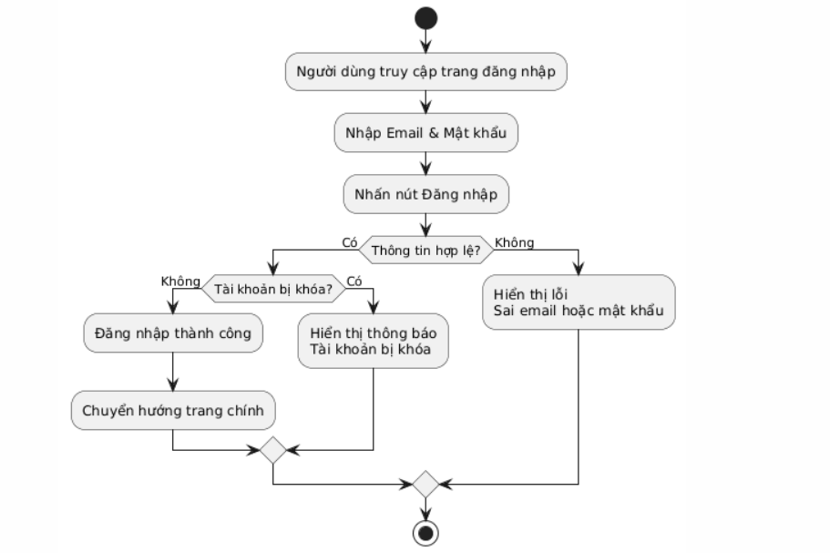
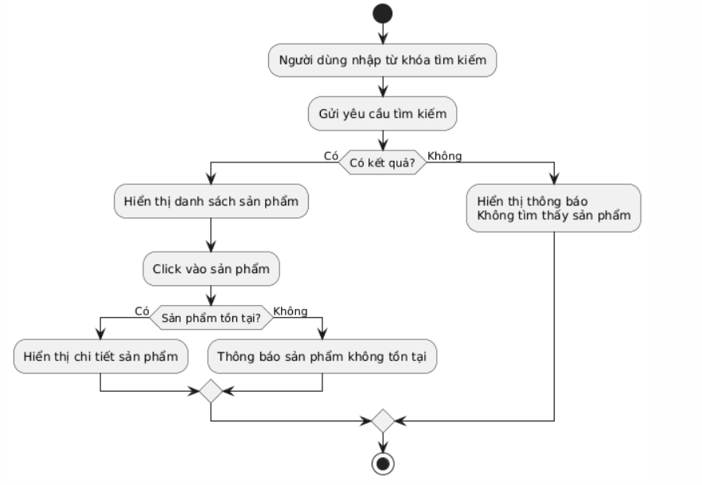
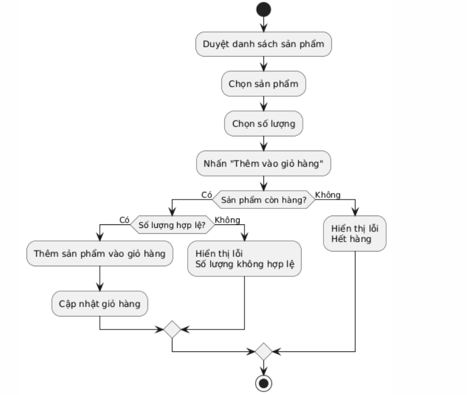
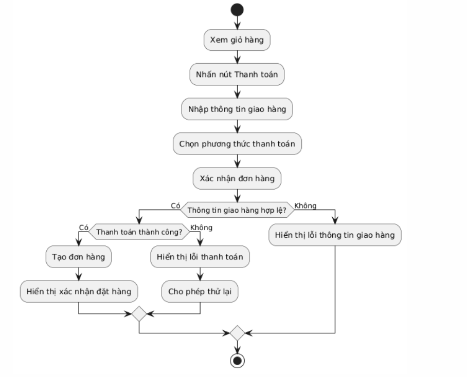
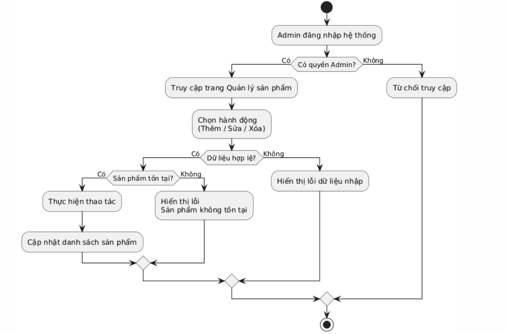

## 4. Kiến trúc phần mềm

Ứng dụng được xây dựng theo **kiến trúc N-Tier**, chia thành các project (lớp) riêng biệt với các trách nhiệm rõ ràng. Mô hình này giúp tăng tính module hóa, dễ bảo trì và tái sử dụng code. Dưới đây là các sơ đồ minh họa cho kiến trúc đã chọn.

*   **`ElectronicShopMVC` (Presentation Layer - Tầng trình diễn):** Chứa giao diện người dùng (UI) và xử lý các yêu cầu HTTP.
*   **`ElectronicShopMVC.DataAccess` (Data Access Layer - Tầng truy cập dữ liệu):** Chịu trách nhiệm giao tiếp với cơ sở dữ liệu.
*   **`ElectronicShopMVC.Model` (Domain Layer - Tầng miền):** Chứa các mô hình dữ liệu của ứng dụng.
*   **`ElectronicShopMVC.Utility` (Shared/Utility Layer - Tầng tiện ích):** Chứa các lớp tiện ích, hằng số dùng chung.

#### Kiến trúc Tổng thể (System Architecture)
Sơ đồ này cung cấp cái nhìn toàn cảnh về các thành phần chính của hệ thống, bao gồm `Web App (MVC)`, `Database`, và các dịch vụ bên ngoài có thể có (như cổng thanh toán), và cách chúng tương tác với nhau trong một môi trường triển khai.

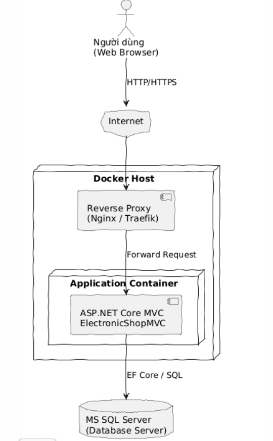

#### Kiến trúc Phân lớp (Layered Architecture)
Sơ đồ thể hiện sự phân chia trách nhiệm của ứng dụng thành các lớp logic: Lớp Trình diễn (UI), Lớp Nghiệp vụ (Business Logic), Lớp Truy cập Dữ liệu (Data Access). Mô hình này giúp hệ thống dễ bảo trì và mở rộng bằng cách cô lập các mối quan tâm khác nhau.

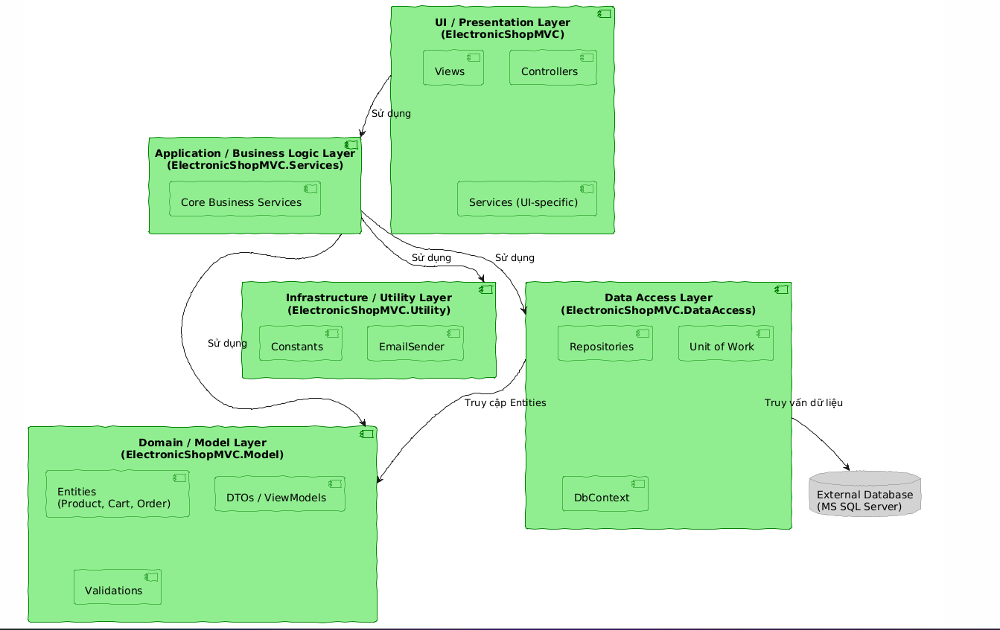

#### Mô hình MVC
Sơ đồ minh họa mẫu thiết kế Model-View-Controller được áp dụng trong tầng trình diễn. `Controller` nhận yêu cầu từ người dùng, tương tác với `Model` (dữ liệu và logic nghiệp vụ), và chọn một `View` để hiển thị kết quả. Điều này giúp tách biệt hoàn toàn giữa giao diện và logic xử lý.

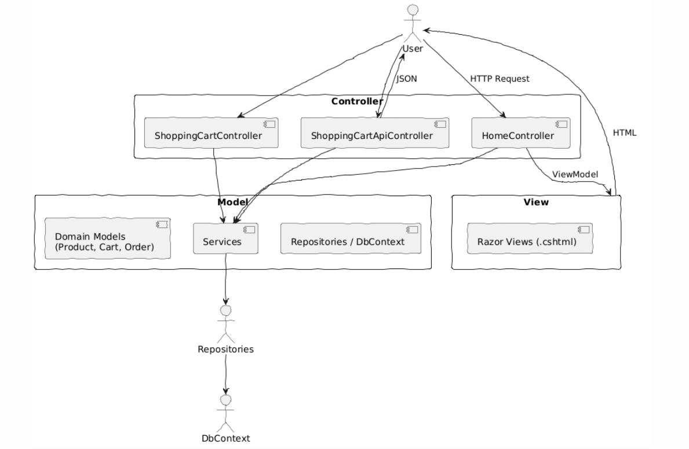

## 5. Thiết kế Cơ sở dữ liệu và Cấu trúc Code

### 5.1. Sơ đồ ERD (Entity-Relationship Diagram)
Lược đồ quan hệ thực thể (ERD) định nghĩa cấu trúc logic của cơ sở dữ liệu. Sơ đồ này trực quan hóa các bảng chính như `Products`, `Categories`, `Orders`, và `Users`, cùng với các thuộc tính (cột) của chúng và các mối quan hệ (một-nhiều, nhiều-nhiều) giữa chúng. Ví dụ, nó cho thấy một `Category` có thể có nhiều `Products`.

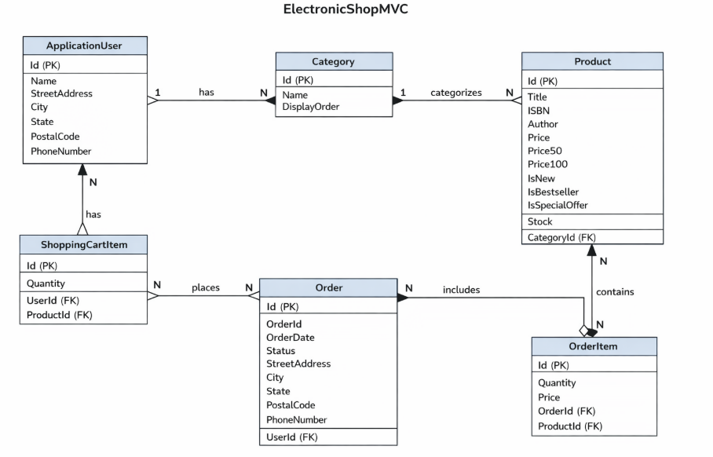

### 5.2. Sơ đồ Lớp (Class Diagram)
Sơ đồ lớp thể hiện cấu trúc tĩnh của hệ thống ở mức mã nguồn. Nó chi tiết hóa các lớp trong project như `ProductRepository`, `CartService`, `HomeController`, các thuộc tính và phương thức của chúng. Sơ đồ này cho thấy mối quan hệ kế thừa, giao diện, và liên kết giữa các lớp, giúp lập trình viên hiểu rõ cấu trúc code.

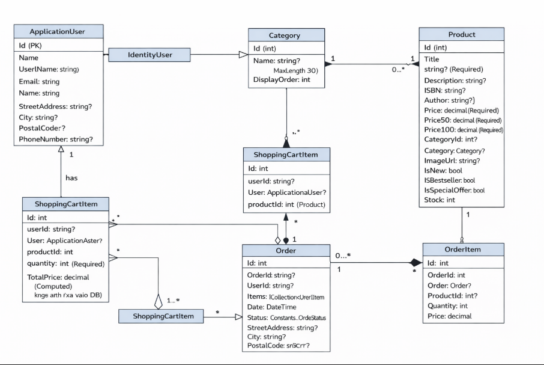

## 6. Công nghệ sử dụng

*   **Nền tảng backend:** ASP.NET Core 8, C# 12
*   **Cơ sở dữ liệu:** Microsoft SQL Server
*   **ORM (Object-Relational Mapping):** Entity Framework Core 8
*   **Giao diện frontend:** Razor Pages, HTML5, CSS3, JavaScript (ES6)
*   **Framework CSS:** Bootstrap 5
*   **Thư viện JavaScript:** jQuery
*   **Xác thực & Phân quyền:** ASP.NET Core Identity
*   **Cổng thanh toán:** VNPay

## 7. Hướng dẫn cài đặt và chạy dự án

### Yêu cầu
*   [.NET 8 SDK](https://dotnet.microsoft.com/download/dotnet/8.0)
*   [Visual Studio 2022](https://visualstudio.microsoft.com/)
*   [Microsoft SQL Server](https://www.microsoft.com/en-us/sql-server/sql-server-downloads)

### Các bước cài đặt

1.  **Clone repository.**
2.  **Cấu hình chuỗi kết nối** trong `ElectronicShopMVC/appsettings.json`.
3.  **Áp dụng Database Migrations** dùng lệnh `Update-Database` trong Package Manager Console.
4.  **Chạy ứng dụng** bằng Visual Studio (F5) hoặc `dotnet run` (chi tiết ở mục 9).

### Tài khoản Admin mặc định
*   **Email:** `admin@example.com`
*   **Mật khẩu:** `Admin@123`

## 8. Triển khai với Docker

Dự án hỗ trợ triển khai bằng Docker và Docker Compose.

### Sơ đồ Triển khai (Deployment Diagram)
Sơ đồ này mô tả kiến trúc vật lý mà ứng dụng được triển khai. Cụ thể, nó cho thấy ứng dụng web chạy trong một `Docker container`, kết nối đến một `container` khác chứa `SQL Server Database`. Sơ đồ này quan trọng cho việc cấu hình môi trường và DevOps.

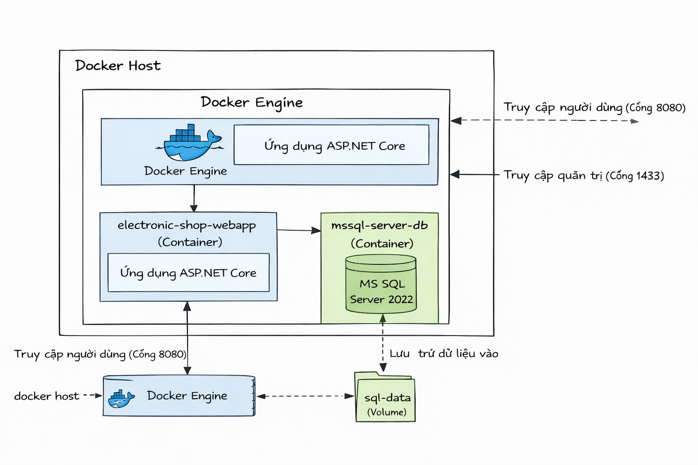

### Hướng dẫn sử dụng:
Quan trọng: Mật khẩu cho tài khoản sa của SQL Server đang được đặt là `yourStrong(!)Password123` trong file `docker-compose.yml`. Bạn nên thay đổi nó thành một mật khẩu an toàn hơn.

Khởi chạy toàn bộ hệ thống:
```bash
docker-compose up --build
```
Truy cập ứng dụng tại `http://localhost:8080`.

Dừng hệ thống:
```bash
docker-compose down
```
Lệnh `down` sẽ dừng và xóa các container nhưng không xóa volume dữ liệu SQL, giúp bảo toàn dữ liệu của bạn.

## 9. Chạy dự án bằng .NET CLI

Ngoài việc chạy dự án qua Visual Studio hoặc Docker, bạn cũng có thể khởi chạy ứng dụng trực tiếp bằng các lệnh của .NET.

1.  **Mở Terminal:** Mở một cửa sổ dòng lệnh (Command Prompt, PowerShell, hoặc Terminal) tại thư mục gốc của dự án.

2.  **Chạy lệnh `dotnet run`:**
    Sử dụng lệnh sau để .NET tự động tìm, build và chạy project chính (`ElectronicShopMVC`):

    ```bash
    dotnet run --project ElectronicShopMVC/ElectronicShopMVC.csproj
    ```

3.  **Truy cập ứng dụng:**
    Sau khi lệnh chạy thành công, terminal sẽ hiển thị các địa chỉ URL mà ứng dụng đang lắng nghe, thông thường là:
    *   `http://localhost:5000`
    *   `https://localhost:5001`

    Bạn có thể mở trình duyệt và truy cập một trong các địa chỉ trên để xem trang web.